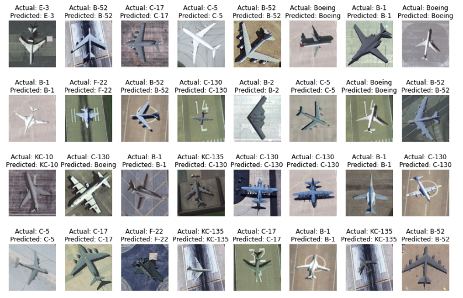

# Multi-class Aircraft Classification

## Overview
MTARSI has a total of 9,385 remote sensing images acquired from Google Earth satellite imagery and manually expanded, including 20 different types of aircraft covering 36 airports.
The data set is made up of the following 20 aircraft types: B-1, B-2, B-29, B-52, Boeing, C-130, C-135, C-17, C-5, E-3, F-16, F-22, KC-10, C-21, U-2, A-10, A-26, P-63, T-6, T-43.
All the sample images are carefully labeled by seven specialists in the field of remote sensing images interpretation. Each image contains one and only one complete aircraft.

The goal of this project is to design and develop an efficient Neural Network that can accurately classify aircraft types at a reasonable inference speed on an edge device.

## Members
- Zachary Lim
- Lucy Wu
- Andrew Sotoodeh
- Shrinivas Joshi
